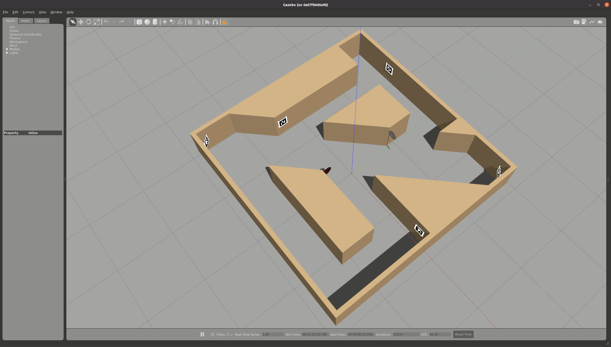

# Toyota Hackathon Fleet Control Challenge

## Description
This project houses the necessary software, simulation tools and code scaffolding for the Fleet Control Challenge. The challenge is to navigate TurtleBots in a known manufacturing-like environment (12ft x 12ft field made by the IDEAs Clinic) while avoiding other TurtleBots/obstacles and adhereing to signage on the field.

## Getting Started

To install the neccesary files:
``` bash
cd simulation_files
./install_sim_files.sh
```


To run the simulation:

``` bash
cd simulation_files
ros2 launch turtlebot_tic_world.launch.py
```

Note: if you want to use a TurtleBot with a camera, please type `export TURTLEBOT3_MODEL=waffle_pi` in your terminal before running step 3 above. By default the environment variable `TURTLEBOT3_MODEL` is set to `burger` which only has a LiDAR.

You should see a TurtleBot 3 model spawned in the Gazebo simulator along with a model of the Toyota Innovation Challenge field setup. You can use the TMMC_Wrapper to interface with this simulated robot.



## Future Plans

If given more time we would implement a proper turning algorithm optomized for speed. Specifically the following article caught our eye which features reactive error correction, a state machine for turning and specifically uses a light sensor: [Wall Following Algorithm for Reactive Autonomous Mobile Robot With Laser Scanner Sensor](https://github.com/ssscassio/ros-wall-follower-2-wheeled-robot/blob/master/report/Wall-following-algorithm-for-reactive%20autonomous-mobile-robot-with-laser-scanner-sensor.pdf)

## Acknowledgment

Started files and simulation resources provided by:  
**Sagar, Leo and Richard from the Engineering-Ideas-Clinic**
