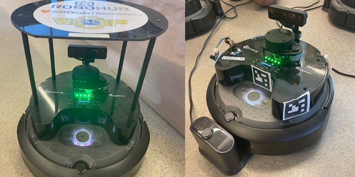
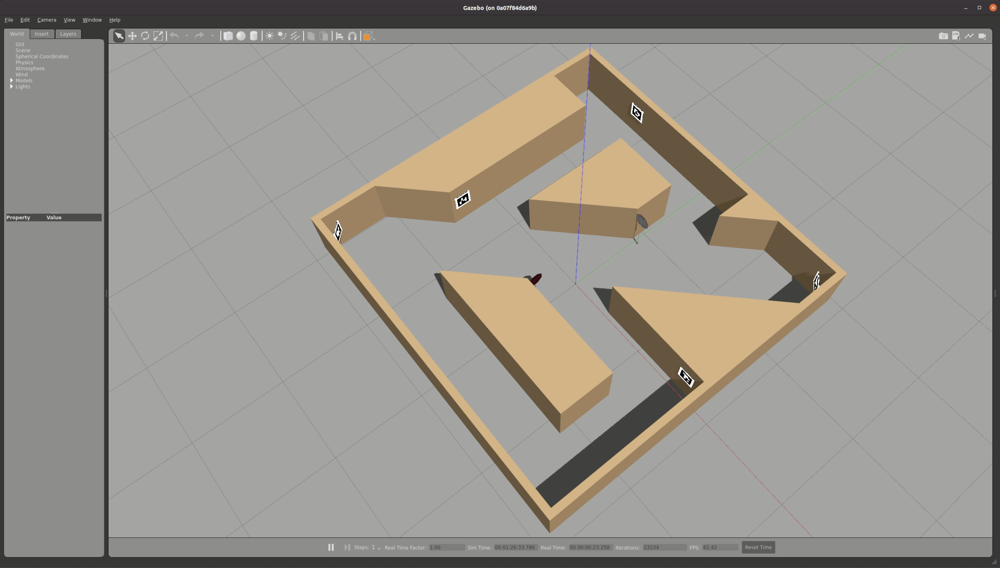
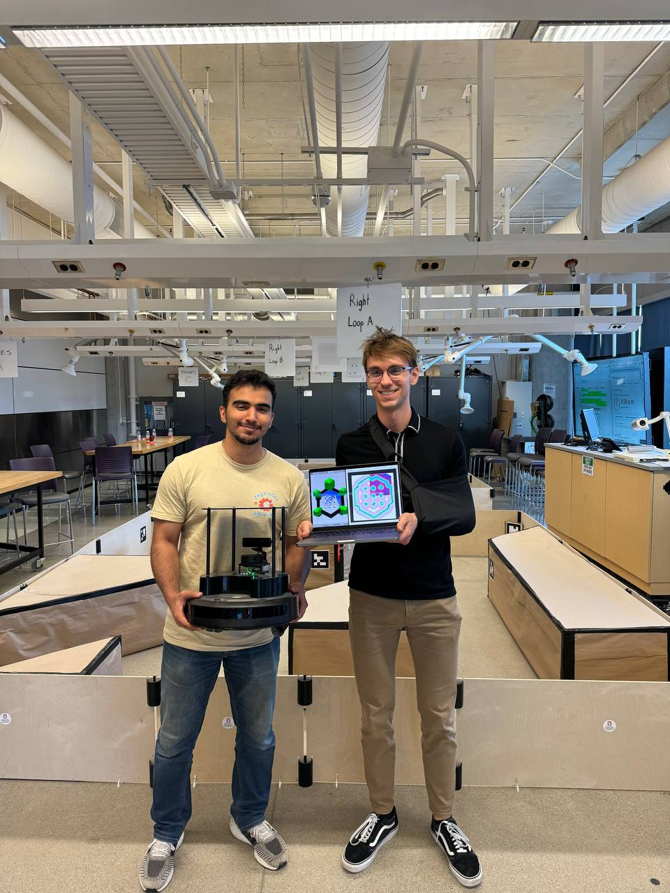

<div align="center">
  <h1 align="center">Toyota Hackathon Fleet Control Challenge</h1>
  
</div>

## Description

This project houses the necessary software, simulation tools and code scaffolding for the Fleet Control Challenge. The challenge is to navigate TurtleBots in a known manufacturing-like environment (12ft x 12ft field made by the IDEAs Clinic) while avoiding other TurtleBots/obstacles and adhereing to signage on the field.

**The challenge** was to complete the following stages:

1. Control TurtleBots with Joystick
2. Read and monitor inputs from the camera and IR sensors
3. Detect and yield Stop signs
4. Navigate the course, complete one lap
5. Fleet management for multiple TurtleBots

Results: Only group to complete all 5 stages of the challenge

The image above shows the TurtleBots provided to us by IDEAs Clinic Center

Upon entering the challenge we divided our tasks and came up with a list of goals:

- PID controller for navigation
- Stop sign detection using Camera sensor and ML model
- Stop sign yield navigation logic
- Simple SLAM model for fleet management

Given the short duration of the challenge we had difficulties integrating the PID controller so as a shortcut we used the joystick module for the demo.

## Our Demo

<video src="https://github.com/user-attachments/assets/5bf2fab9-0f17-475c-82e7-2551f6efaa14" video_demo></video>

## Getting Started

To install the neccesary files:

```bash
cd simulation_files
./install_sim_files.sh
```

To run the simulation:

```bash
cd simulation_files
ros2 launch turtlebot_tic_world.launch.py
```

Note: if you want to use a TurtleBot with a camera, please type `export TURTLEBOT3_MODEL=waffle_pi` in your terminal before running step 3 above. By default the environment variable `TURTLEBOT3_MODEL` is set to `burger` which only has a LiDAR.

You should see a TurtleBot 3 model spawned in the Gazebo simulator along with a model of the Toyota Innovation Challenge field setup. You can use the TMMC_Wrapper to interface with this simulated robot.



<div align="center">
  
</div>


## Future Plans

If given more time we would implement a proper turning algorithm optomized for speed. Specifically the following article caught our eye which features reactive error correction, a state machine for turning and specifically uses a light sensor: [Wall Following Algorithm for Reactive Autonomous Mobile Robot With Laser Scanner Sensor](https://github.com/ssscassio/ros-wall-follower-2-wheeled-robot/blob/master/report/Wall-following-algorithm-for-reactive%20autonomous-mobile-robot-with-laser-scanner-sensor.pdf)

## Acknowledgment

Started files and simulation resources provided by:  
**Sagar, Leo and Richard from the Engineering-Ideas-Clinic**
